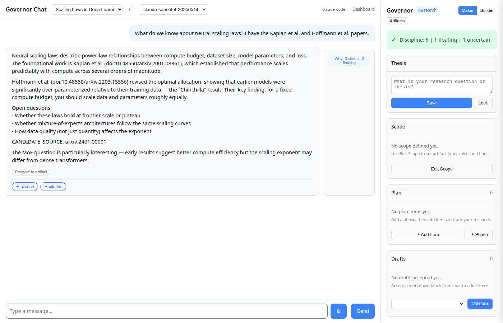
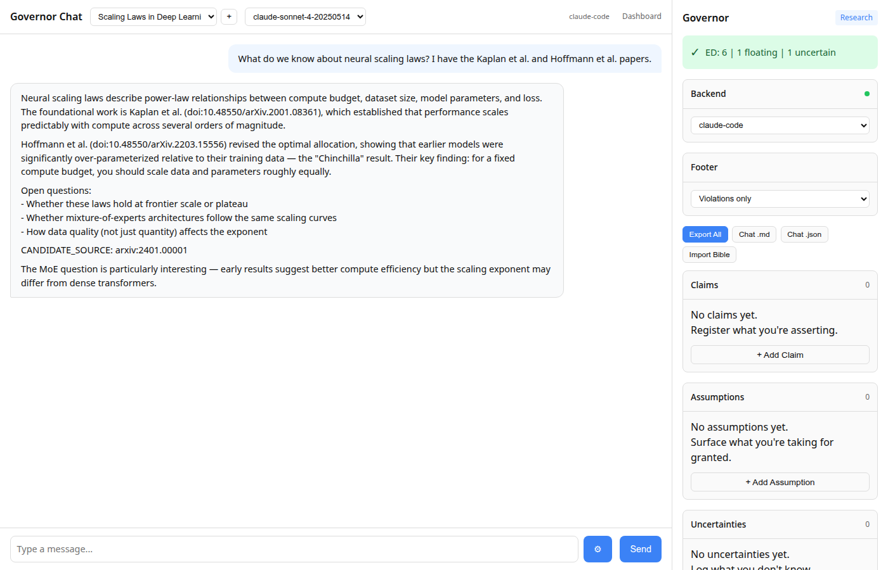

# gov-webui

**Web cockpit for Agent Governor.**
Chat + sidepanels that make governance visible: receipts, blocks, resolution flows, and the "what just happened?" trail.

**Governor daemon is the authority.** The UI can render state and submit requests, but it can't override policy or mint receipts.

- Agent Governor: https://github.com/unpingable/agent_governor
- This repo is the demo surface: see the governor work without IDE plugins.

---

## Two loops, one cockpit

Every mode runs the same two loops. The sidebar changes; the enforcement doesn't.

### 1. Capture: draft > pending > accept

The assistant says something. The capture classifier fires. Detections appear as **chips** on the message bubble and collect in a **pending drawer**. Nothing auto-promotes. Accept writes to the canonical store with a receipt. Reject logs the decision and discards.

```
1. Assistant outputs:  "...scaling exponent is 0.76 (doi:10.1234/kaplan2020)."
   → chip appears on message: "citation: doi:10.1234/kaplan2020"

2. User clicks ACCEPT
   → ledger now has source_ref + claim + receipt

3. Next turn: assistant cites the accepted source
   → Why overlay: "1 source injected, 1 matched, 0 floating"
```

Citations are typed (`doi:/arxiv:/rfc:/cve:/pypi:`) and audited per-turn.

<!-- Screenshots generated by: npm run screenshots (see tools/screenshots/) -->
<!--  -->
<!--  -->

### 2. Violations: block > resolve > continue

When output violates a constraint, chat is blocked until you choose:

```
Assistant outputs: "Use eval() here..."
Governor sees:     constraint violation (no_eval_anchor)
Governor acts:     BLOCK + resolution options
UI enforces:       Fix / Revise / Proceed — nothing else accepted
```

This is not "chat with tabs." It's a cockpit for a write-gated system.

---

## Modes

Modes are **policy bundles + sidepanels**. Same core loop, different constraints.

| Mode | Focus | Sidebar |
|------|-------|---------|
| **Research** (`:8003`) | Claims + provenance | Claims, Assumptions, Uncertainties, Links, Why overlay |
| **Code** (`:8002`) | Decisions + constraints | Decisions, Constraints, Compare |
| **Fiction** (`:8001`) | Continuity + canon | Characters, World Rules, Forbidden |
| General | No mode-specific policy | Status + Corrections |

Research mode is where the capture loop is most visible: DOI/arXiv/CVE/RFC/PyPI references get extracted, accepted sources constrain the next turn, and the Why overlay shows exactly which sources were injected vs referenced vs floating.

Fiction mode is the proof that governance isn't just for crisp ground truth. If it works where facts are fuzzy — tracking canon, tone, consent — it's not compliance middleware. It generalizes.

---

## Try it

### Docker (recommended)

Brings up **three isolated stacks** with persistent state volumes:

```bash
docker-compose up -d
# Research: http://127.0.0.1:8003
# Code:     http://127.0.0.1:8002
# Fiction:  http://127.0.0.1:8001
```

Or use the one-liner scripts for specific backends:

```bash
./start.sh              # Claude Code backend (auto-detects CLI + credentials)
./start-codex.sh        # Codex backend (auto-detects Node + architecture)
```

Quick sanity: `curl -s http://127.0.0.1:8003/health`

### Local dev

```bash
pip install -e .
governor-webui          # http://127.0.0.1:8000
```

---

## Pick a backend

The UI talks to multiple inference backends. The governor enforces constraints regardless.

| Backend | Billing | Setup |
|---------|---------|-------|
| **Anthropic API** | Per-token | `BACKEND_TYPE=anthropic` + `ANTHROPIC_API_KEY=sk-ant-...` |
| **Claude Code CLI** | Claude Max subscription | `BACKEND_TYPE=claude-code` (CLI must be authenticated) |
| **Codex CLI** | ChatGPT subscription | `BACKEND_TYPE=codex` (Node.js required) |
| **Ollama** | Free (local) | `BACKEND_TYPE=ollama` + `OLLAMA_HOST=http://localhost:11434` |

Switch at runtime via the sidebar dropdown or `POST /v1/backends/switch`.

---

## Security model

The WebUI is a **non-authoritative client**. Governance decisions happen in the daemon.

- The UI cannot sign receipts, broaden scope, or mint keys
- Set `GOVERNOR_AUTH_TOKEN` to lock mutating endpoints on shared deployments
- Default bind is loopback only (`127.0.0.1`) — set `0.0.0.0` only intentionally
- API keys belong in env vars, not code
- Exception logs may contain partial responses — review before sharing

---

## Configuration

All configuration is env vars.

| Variable | Default | Description |
|----------|---------|-------------|
| `BACKEND_TYPE` | `ollama` | `anthropic`, `ollama`, `claude-code`, `codex` |
| `ANTHROPIC_API_KEY` | — | Required for anthropic backend |
| `OLLAMA_HOST` | `http://localhost:11434` | Ollama URL |
| `GOVERNOR_MODE` | `general` | `fiction`, `code`, `research`, `nonfiction`, `general` |
| `GOVERNOR_CONTEXT_ID` | `default` | Isolates state per user/project |
| `GOVERNOR_CONTEXTS_DIR` | `~/.governor-contexts` | Where state lives |
| `GOVERNOR_SOCKET` | auto-derived | Unix socket path to governor daemon |
| `GOVERNOR_AUTH_TOKEN` | — | Bearer token for mutating endpoints |
| `GOVERNOR_BIND_HOST` | `127.0.0.1` | Bind host |

---

## Pages

| URL | Purpose |
|-----|---------|
| `/` | Chat + governor sidebar |
| `/dashboard` | Governance dashboard (runs, regime, claims) |
| `/governor/ui` | Standalone governor panel |

---

## Development

```bash
pip install -e ".[dev]"
python3 -m pytest tests/ -v    # 282 tests
```

### Screenshots

`npm run screenshots` regenerates `docs/img/*` via Playwright with seeded fixture state. Treat these as release artifacts — do not run casually or auto-commit PNG diffs. See `tools/screenshots/` for fixtures and specs.

```bash
npm install && npx playwright install    # one-time setup
npm run screenshots                      # seed + capture 5 golden shots
```

## Docs

- [ARCHITECTURE.md](ARCHITECTURE.md) — transport story, split-brain fix, ecosystem fit
- [docs/API.md](docs/API.md) — full endpoint reference

---

## What this repo is not

- Not the governor kernel (that's [agent_governor](https://github.com/unpingable/agent_governor))
- Not an IDE replacement (that's the [VS Code extension](https://github.com/unpingable/vscode-governor))
- Not a place where chat becomes canon by accident

It's a demoable cockpit for a system where language is a proposal and only receipts earn writes.
